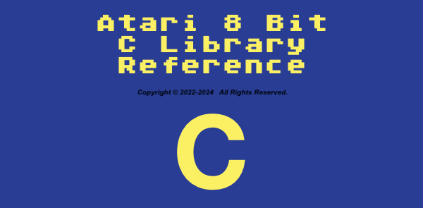

# A8 C Window Library
Atari 8 Bit Text Mode Windowing Library written in C (CC65).

This is a text mode windowing library complete with window controls and modern gadgets (widgets).  The gadgets allow you to build input forms that use buttons, radio buttons, input strings (with scrolled lengths and type restrictions), check boxes, progress bars, etc.  This allows you to build applications with "modern"-ish interfaces.  I refer to this as a TUI - Text User Interface.  

The windowing system preserves the contents under a window, but is not z-order based (by design).  It is up to you to open and close windows in the correct order.  Complete sample programs are included, as well as full API documentation.

I originally wrote this in Action! language for the Atari 8 bit starting in 2015.  I added to it continually up through this year (2022).

I ran into some limitations with the Action! version in a project regarding memory space and function paramater size when compiled into a standlone executable.  This prompted the conversion into C.   I considered several C implementations on the Atari 8 bit itself, then settled on CC65 to use modern development tools and target the A8 platform.  The C version is now the primary version of the library, and has advanced beyond the Action! version.

Version 1.1 brought the addition of APE Time bindings to the library, which allows the retrieval of the date and time from an APE Time compatible device or software.  This was unpublished because I was also working on the 1.2 release which I thought would be right on the APE bindings heals.  

Version 1.2 brings the addition of FujiNet bindings to the library.  This consists of a core set of functions for communicating with the FujiNet (opening connections, reading from, writing to, and closing connections, etc).  It also includes Base64 encoding and decoding by means of the FujiNet, as well as hashing using SHA1, SHA256, and SHA512.  Offloading these compute intensive operations to the FujiNet, yet enabling the Atari to work with them!

Version 1.21 brings performance improvements courtesy of @billkendrick.  Approximately 15% faster.  Performance test added to appdemo.c.

Version 1.30 brings borderless / frameless window support, minor bug fix in WPrint(), and a reworked Menu() function that adds support for horizontal (single line) menu bars.

Version 1.40 brings GList() which is a list selection input control.

Version 1.42 brings fix to GList() navigation to make more sense, adding GUPPER to GInput() to force uppercase text, and adds remaining A-Z keycodes in primary header file.

Version 1.43 brings fix to Menu() selected item de-highlight placement at exit when used in horizontal orientation.

Version 1.44 brings GLOWER to GInput() to force lowercase text, and GFNAME to GInput() to force uppercase and only allow valid filename characters.

License: GNU General Public License v3.0

See the LICENSE file for full license information.
